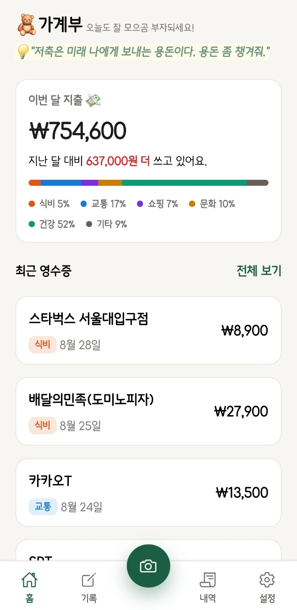
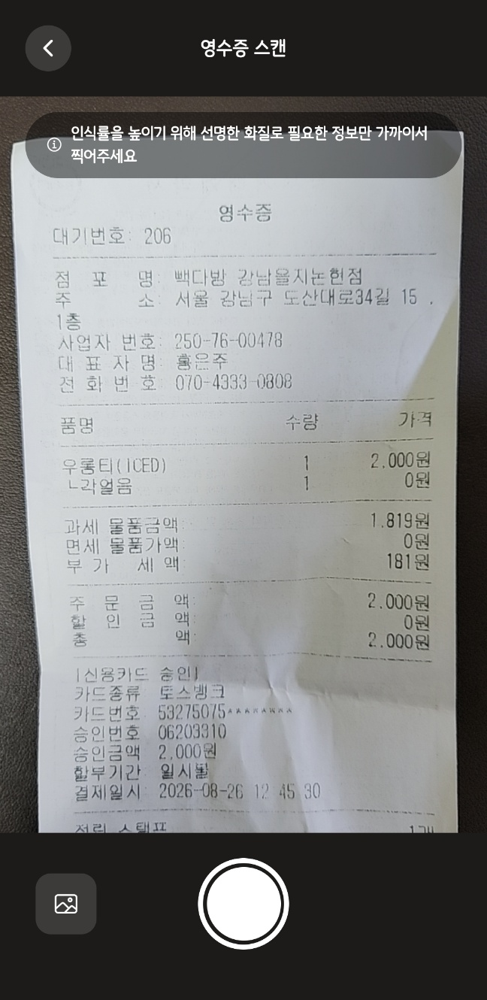
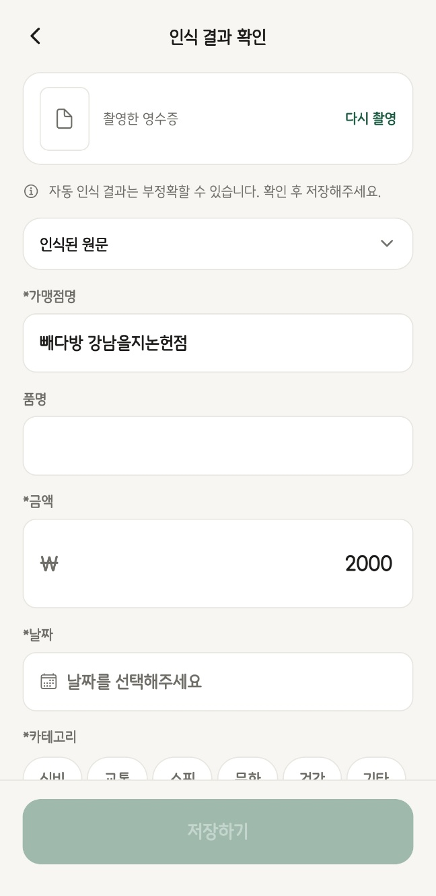
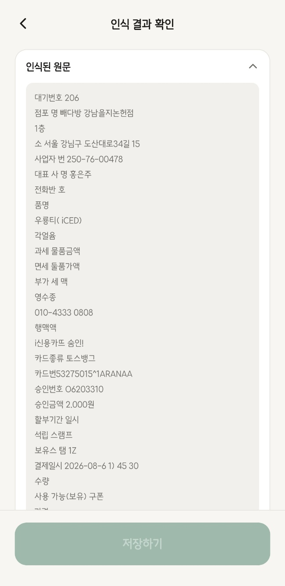
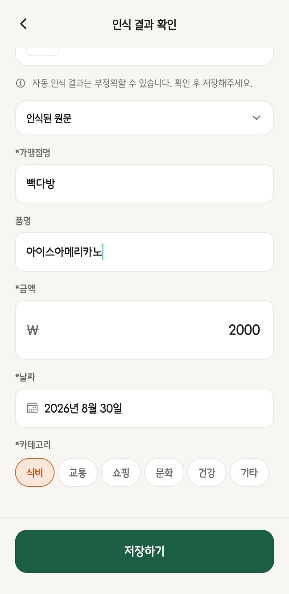
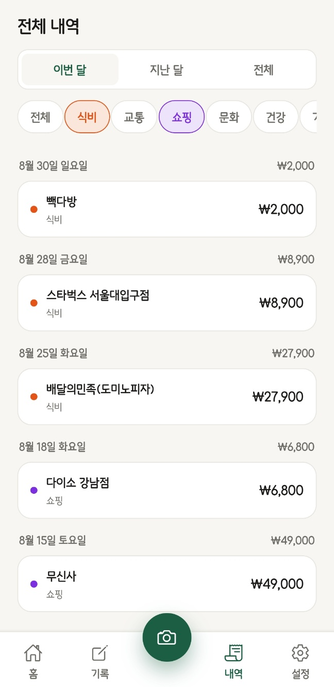
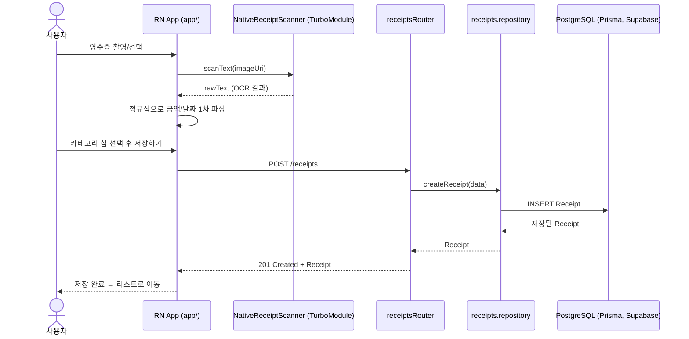

# 🧸 모으곰 (Mogom)

영수증을 촬영하면 온디바이스 OCR(Optical Character Recognition, 광학 문자 인식)로 가맹점명·금액·날짜를 자동으로 인식해 기록해주는 가계부 앱입니다.

## 데모

|               홈                |               스캔                |                 인식 결과 확인 1                  |                 인식 결과 확인 2                  |                 인식 결과 확인 3                  |               전체 내역                |
| :-----------------------------: | :-------------------------------: | :-----------------------------------------------: | :-----------------------------------------------: | :-----------------------------------------------: | :------------------------------------: |
|  |  |  |  |  |  |

## 주요 기능

- **영수증 촬영/선택 → 자동 인식**: 카메라로 찍거나 갤러리에서 고르면, 커스텀 네이티브 모듈이 사진 속 텍스트를 기기 안에서 바로 인식합니다. 사진 파일 자체는 서버로 전송되지 않습니다.
- **인식 결과 확인 및 수정**: 인식된 가맹점명/금액/날짜를 자동으로 채워주되, 저장 전에 직접 확인하고 카테고리를 선택해 수정할 수 있습니다.
- **직접 작성**: 촬영 없이 수기로도 지출을 기록할 수 있습니다.
- **월별 요약 및 필터링**: 이번 달 지출 요약, 카테고리·기간별 목록 조회를 지원합니다.
- **개인정보처리방침 / 이용약관**: 설정 화면 안에서 바로 확인할 수 있습니다.

## 영수증 등록 흐름



## 기술 스택

| 구분           | 사용 기술                                                                   |
| -------------- | --------------------------------------------------------------------------- |
| 코어           | React Native 0.87 (New Architecture), React 19, TypeScript                  |
| 내비게이션     | React Navigation (Native Stack + Bottom Tabs)                               |
| 상태/데이터    | TanStack Query, Zustand, React Hook Form                                    |
| 스타일링       | Tailwind CSS + uniwind                                                      |
| 카메라/이미지  | react-native-vision-camera, react-native-image-picker                       |
| 온디바이스 OCR | 커스텀 TurboModule (Android: ML Kit 한국어 인식기 / iOS: Vision 프레임워크) |
| 네트워킹       | Axios, 기기별 `X-Device-Id` 헤더 기반 무가입 인증                           |
| 모니터링       | Firebase Crashlytics                                                        |
| 기타           | react-native-bootsplash, react-native-webview, react-native-reanimated      |
| 테스트         | Jest, React Native Testing Library, MSW                                     |

## 아키텍처

- **기능 단위(feature-based) 구조**: `scan`(촬영/인식), `receipt`(목록/상세/작성), `settings`로 화면·API·유틸을 도메인별로 분리했습니다.
- **온디바이스 OCR 커스텀 TurboModule**: `specs/NativeReceiptScanner.ts`에 정의된 스펙을 기준으로, Android(Kotlin)는 ML Kit, iOS(Swift)는 Vision 프레임워크로 각각 구현해 하나의 JS 인터페이스(`scanText`)로 호출합니다.
- **회원가입 없는 인증**: 로그인 절차 없이 기기 식별자(`X-Device-Id`)로 사용자를 구분하며, 모든 요청에 자동으로 실려 나갑니다.
- **에러 모니터링**: 렌더링 중 잡히지 않은 에러와 API 실패를 화면·API 컨텍스트와 함께 Firebase Crashlytics로 기록합니다.

```
src/
├── app/            # 앱 진입점, 내비게이션 구조
├── features/
│   ├── scan/       # 촬영, 온디바이스 OCR 결과 확인/수정
│   ├── receipt/    # 목록, 상세, 요약, 직접 작성
│   └── settings/   # 설정, 라이선스, 약관 WebView
├── shared/         # API 클라이언트, 공통 컴포넌트, Firebase, 전역 스토어
└── mocks/          # MSW 기반 API 목(mock)

specs/              # 커스텀 TurboModule 스펙 (NativeReceiptScanner)
legal/              # 개인정보처리방침·이용약관 정적 페이지 (GitHub Pages로 서빙)
```

## AI 에이전트 활용

이 프로젝트는 AI 에이전트와 협업하여 만들었습니다. AI 에이전트의 활용 범위와 영향력이 점점 커지는 요즘, 에이전트를 잘 다루고 조율하는 능력을 기르는 것도 이 프로젝트의 목적 중 하나였습니다.

이 프로젝트를 통해 에이전트와 협업하며 연습한 것:

> AI 에이전트를 결과물을 받는 단순 도구가 아니라 검증이 필요한 협업 파트너다.

1. 작업을 통째로 맡기지 않고 단계마다 정지점을 둬서, 진행 속도 자체를 명시적으로 조율하며 각 단계를 직접 검수 및 리뷰합니다.
2. 빠르게 버전이 바뀌는 라이브러리를 다룰 때는 에이전트의 기억이 아니라 공식 문서를 먼저 확인하도록 지침을 미리 박아둬 오래된 버전으로 인한 오류를 사전에 방지합니다.
3. 구현은 TDD로 진행해 테스트가 명세를 먼저 규정하게 함으로써 프로덕트의 안정성을 한 단계 더 끌어올립니다.
4. 불확실성이 큰 이슈에 대해서는 에이전트가 스스로 가설을 세우고 실제 측정으로 검증 및 반증하며, 통하지 않으면 그걸 숨기지 않고 실패로 인정하도록 요구합니다.
5. 어떤 방식을 추천할 때도 근거 없이 받아들이지 않고 반드시 명확한 근거와 트레이드오프를 함께 제시하게 해, 최종 판단은 항상 제가 내리는 구조를 유지합니다.

이런 습관들이 쌓이면서 AI 에이전트는 빠르게 답만 내놓는 도구가 아니라, 가설을 세우고 실험하며 스스로를 검증하는 신뢰할 수 있는 협업 파트너가 됐습니다.
